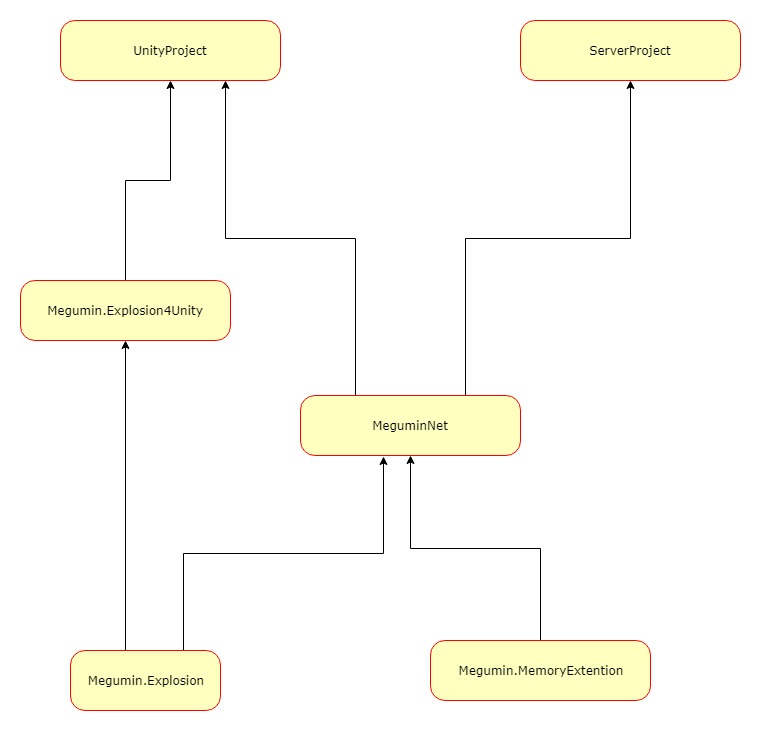

# 这是什么？
这是一些常用扩展函数。是整个Megumin系列类库的最底层基础库。  
还有一些UnityPackage,是unity用的扩展函数，和一些常用类。  

# UPM Package
### Install via git URL

or add `"com.megumin.explosion4unity": "https://github.com/KumoKyaku/Megumin.Explosion.git?path=Megumin.UnityPackage/Packages/megumin.explosion4unity"` to `Packages/manifest.json`.

>If you want to set a target version, uses the `*.*.*` release tag so you can specify a version like `#2.1.0`. For example `https://github.com/Cysharp/UniTask.git?path=src/UniTask/Assets/Plugins/UniTask#2.1.0`.

# 功能列表
- Package wizard，一键生成包目录结构
- Inspector导航，支持鼠标侧键切换最近选中对象。
- EditorButton，将函数之间绘制在Inpector面板，支持参数。
- Enum2String，在Inpector将string绘制为Enum。
- TargetPoint，可视化目标点。

# [依赖关系](Image/dependencies.xml)

