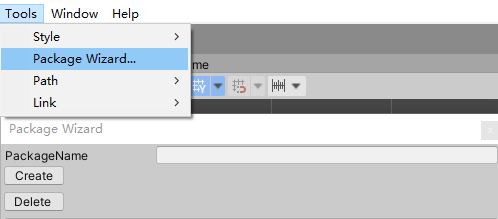
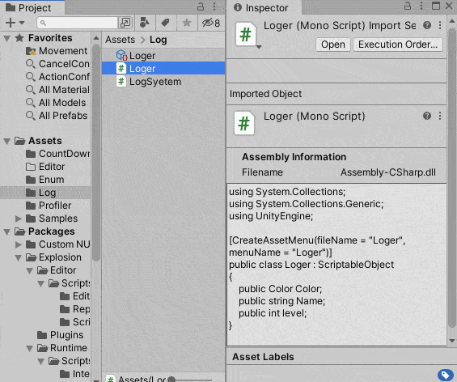
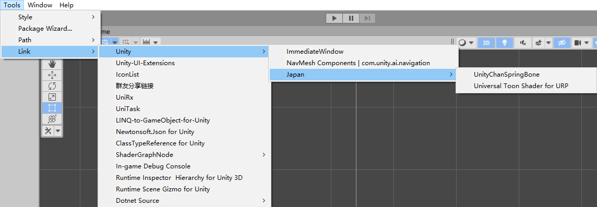
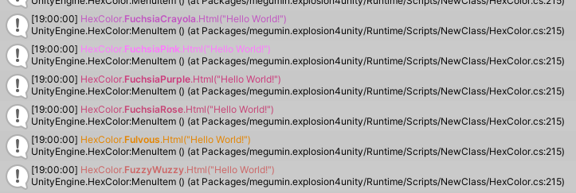
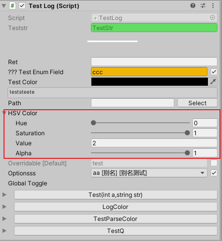
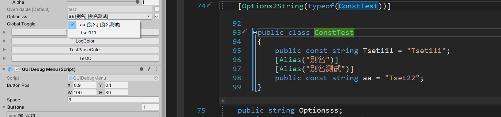
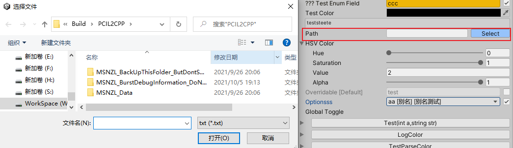
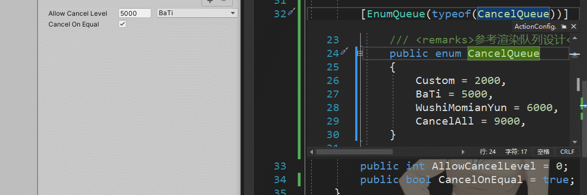
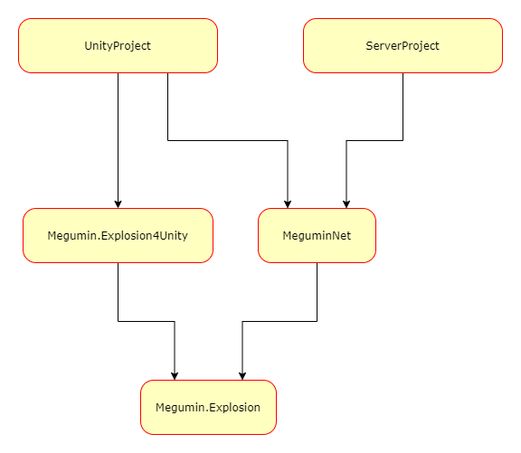

# 这是什么？
这是一些常用扩展函数。是整个Megumin系列类库的最底层基础库。  
还有一些UnityPackage,是unity用的扩展函数，和一些常用类。  

# UPM Package

## Install via git URL

or add `"com.megumin.explosion4unity": "https://github.com/KumoKyaku/Megumin.Explosion.git?path=Megumin.UnityPackage/Packages/megumin.explosion4unity"` to `Packages/manifest.json`.

>If you want to set a target version, uses the `*.*.*` release tag so you can specify a version like `#2.1.0`. For example `https://github.com/Cysharp/UniTask.git?path=src/UniTask/Assets/Plugins/UniTask#2.1.0`.

## 当前版本目标框架为netstandard2.1
> error CS1705: Assembly 'Megumin.Explosion' with identity 'Megumin.Explosion, Version=0.1.4.0, Culture=neutral, PublicKeyToken=83a041e0a8636db9' uses 'netstandard, Version=2.1.0.0, Culture=neutral, PublicKeyToken=cc7b13ffcd2ddd51' which has a higher version than referenced assembly 'netstandard' with identity 'netstandard, Version=2.0.0.0, Culture=neutral, PublicKeyToken=cc7b13ffcd2ddd51

Unity2021.2之前的版本请使用 vnetstandard2.0版本,后续不会在维护旧版本.  
Add `"com.megumin.explosion4unity": "https://github.com/KumoKyaku/Megumin.Explosion.git?path=Megumin.UnityPackage/Packages/megumin.explosion4unity#vnetstandard2.0"` to `Packages/manifest.json`.

## 部分代码拆分到Common包
https://github.com/0x3f3f3f3f/Megumin.Common

# 功能列表

编辑器功能：
- Package wizard，一键生成包目录结构.  
    
- Inspector导航，支持鼠标侧键切换最近选中对象。
- 设置编辑器内置图标。  
  
- Link，一些常用插件链接。  
  
- ScriptObjectDrawer，ScriptObject面版增加new和clone两个按钮。

脚本组件：
- TargetPoint，可视化目标点。
- 通用CD功能    
  
- ColliderRenderer，运行时绘制碰撞体。
- LabelRenderer，运行时显示一个标签，支持宏配置。
- DebugMeshRenderer, 运行时绘制一个mesh.
- UrlImage，支持网络图片，不用把图片资源放到项目里，方便demo制作。
- GUIFPS，原生GUI显示帧率。

数据类型：
- HexColor，十六进制颜色，支持字符串解析。  
  
- HSVColor  
   
- Pref，支持用户配置功能。
- Overrideable，泛型可以重写字段，支持一个默认值和重写值。    
  
- Enableable,泛型可快关字段.    
  
- iint，支持正负无穷的int类型。  
  

特性：  
- Options2StringAttribute，将一个类里的string字段在Inspector中显示为下拉菜单。  
  
- PathAttribute，string字段快速路径序列化。  
  
- EditorButtonAttribute，将函数之间绘制在Inpector面板，支持参数。
- Enum2StringAttribute，在Inpector将string绘制为Enum。
- ReadOnlyInInspectorAttribute，在Inpector显示为只读。
- HelpBoxAttribute，显示一个帮助Label。
- GUIDAttribute，将一个string自动填入guid。
- EnumQueueAttribute,一个像renderqueue那样的属性抽屉.  
  

# [依赖关系](Image/dependencies.xml)

